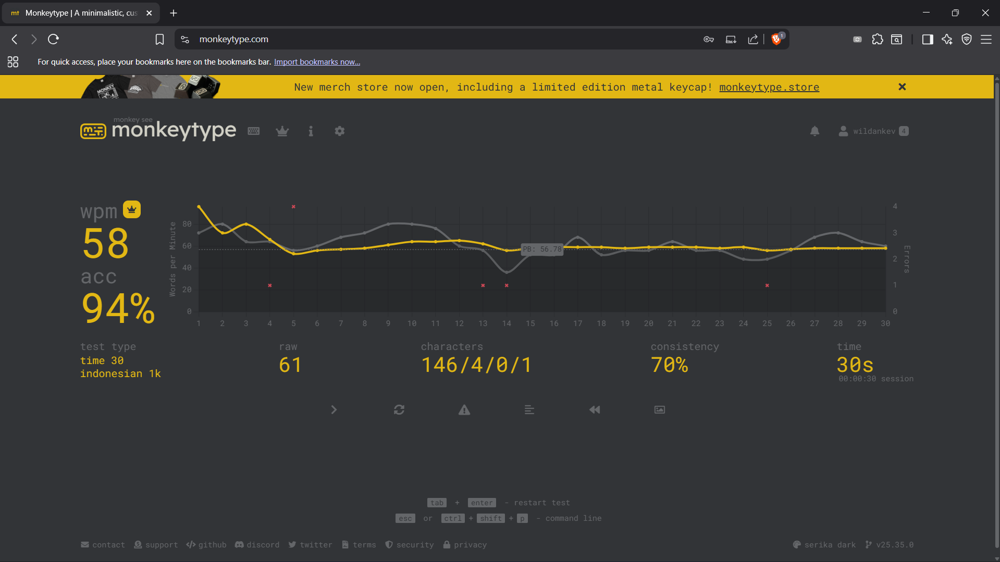

# Typing Speed Journey – Monkeytype Training

Dokumentasi ini berisi perjalanan saya dalam melatih kecepatan mengetik menggunakan [Monkeytype](https://monkeytype.com) selama satu minggu.  
Tujuan utama saya adalah **mencapai kecepatan di atas 60 WPM** dengan tetap menjaga akurasi, dan menjadikan aktivitas mengetik lebih natural menggunakan lebih banyak jari.

---

## Latar Belakang
Sejak lama, saya terbiasa mengetik hanya dengan **dua jari telunjuk kiri dan kanan**. Cara ini memang cukup untuk sekadar menulis, namun ketika mulai kuliah di bidang Informatika, saya menyadari keterampilan mengetik cepat dan akurat sangat penting — baik untuk menulis kode, menyusun laporan, maupun aktivitas sehari-hari di komputer.  

Dengan alasan itu, saya memutuskan untuk melatih diri agar bisa meningkatkan skill mengetik dan mulai beralih ke metode yang lebih efektif.

---

## Strategi Latihan
Saya dalam seminggu ini berlatih **setiap hari minimal 7 menit** (rata-rata sekitar 15 menit per hari). Fokus utama saya di awal adalah **kecepatan**, meskipun terkadang hal itu membuat typo lebih sering terjadi.  

Metode latihan:  
- Menggunakan mode **30 detik (time 30s)** di Monkeytype.  
- Bahasa utama: **Indonesia (1k words)**.  
- Referensi tutorial YouTube untuk postur dan teknik mengetik:  
  - [How to Type Faster (Tips and Tricks)](https://www.youtube.com/watch?v=QAb3ATOpBpE)  
  - [Learn to Type Faster with 10 Fingers](https://www.youtube.com/watch?v=tU_AXrvQjpo)  

---

## Perjalanan & Progress

### Hari Pertama (Percobaan Awal)
- **WPM:** 44  
- **Accuracy:** 79%  
- **Catatan:** Baru mencoba pertama kali. Masih banyak typo, jari cepat pegal, dan benar-benar belum terbiasa menggunakan lebih banyak jari.  
- **Screenshot:**  
  

---

### Hari Keempat (Setelah Beberapa Hari Latihan)
- **WPM:** 58  
- **Accuracy:** 94%  
- **Catatan:** Mulai terbiasa dengan posisi jari. Latihan singkat setiap hari mulai terasa hasilnya. Postur mengetik yang benar membantu mengurangi rasa pegal.  
- **Screenshot:**  
  

---

### Hari Ketujuh (Progress Terkini)
- **WPM:** 65  
- **Accuracy:** 94%  
- **Catatan:** Target awal tercapai! Saya sudah bisa menembus **60 WPM**. Walau masih belum sepenuhnya memakai 10 jari, peningkatan ini membuat saya lebih percaya diri untuk melanjutkan ke level berikutnya.  
- **Screenshot:**  
  

---

## Kendala yang Dihadapi
- **Belum terbiasa menggunakan keseluruhan jari.** Masih ada kecenderungan hanya mengandalkan dua jari telunjuk.  
- **Sering typo** ketika mencoba meningkatkan kecepatan.  
- **Jari cepat pegal** di awal latihan, terutama saat memaksa diri menjaga ritme lebih cepat.  

Namun dengan latihan singkat setiap hari, kendala ini perlahan bisa diatasi.

---

## Bahasa Lain
Selain menggunakan bahasa Indonesia, saya juga mencoba mengetik dalam bahasa Inggris.  
- **Personal Best (English):** 50 WPM  

Target saya ke depan adalah tidak hanya cepat di bahasa Indonesia, tetapi juga terbiasa dengan **foreign language typing**.

---

## Hasil & Refleksi
- **Awal:** 44 WPM (79% akurasi)  
- **Tengah:** 58 WPM (94% akurasi)  
- **Terkini:** 65 WPM (94% akurasi)  

Dalam **1 minggu**, saya berhasil naik lebih dari **20 WPM**.  
Peningkatan ini memberi keyakinan bahwa latihan konsisten, meskipun singkat, bisa memberikan hasil signifikan.

---

## Next Goals
1. Stabil di **75 WPM** dengan akurasi di atas 90%.  
2. Menguasai teknik **10-finger typing** secara penuh.  
3. Mengembangkan kemampuan mengetik dalam **bahasa asing** (Inggris terlebih dahulu, lalu bahasa lain).  

---

*Latihan ini hanyalah langkah awal. Saya percaya keterampilan mengetik cepat akan menjadi bekal penting untuk kuliah, kerja, maupun produktivitas sehari-hari.*
